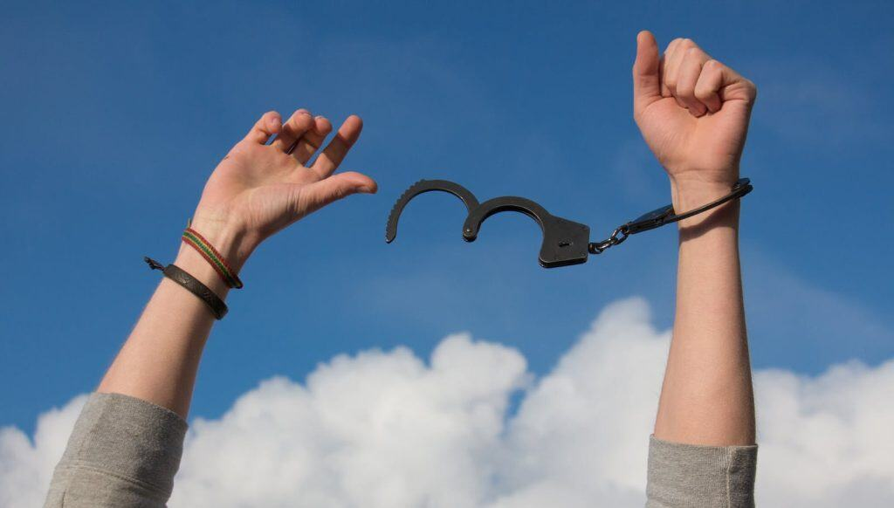

Many suffer in high-paying jobs with hidden pain. Unshackling yourself can ease that toll from golden handcuffs. You might like good benefits, but misery, burnout, and worry build up. I’ve felt that load too. This post looks at those feelings, why you stay trapped, and ways to break free for purpose. It brings hope, clear steps, and encouragement. So, let’s begin this journey!

## The Problem of Golden Handcuffs and Emotional Toll

Quitting a well-paid job feels hard, and unease grows. You have a high salary with perks, but burnout and worry set in. A 2023 APA study shows 70% of senior workers feel misery or want meaning in these roles—golden handcuffs that tie you with money despite sad feelings. Failure might happen—a big change—but it teaches strength. Staying stuck makes despair worse. Therefore, let’s face this issue.

## Why Unshackling Yourself Matters

Unshackling yourself needs bravery, and knowing why matters. Admitting misery, burnout, and a need for purpose shows it’s time to change. These feelings mean your life doesn’t fit your dreams. Without action, you stay in a sad loop. A job gives safety, but it dulls your heart. Because freedom lifts your spirit, it’s time to seek more.

## Inspiration from Emotional Liberation

Real stories prove this works. Sarah Nguyen, a ex-CFO, quit her $150K job for a nonprofit, beating burnout (Forbes, 2024). Early struggles hit her, but she found joy. James Patel, a former marketing boss, took up photography, overcoming worry (Business Insider, 2023). A slow start brought him peace. Laura Kim, a senior lawyer, started a wellness blog, leaving misery behind (Inc., 2024). Her first posts flopped, yet she succeeded. Their journeys show unshackling brings happiness, and moreover, they guide you.

## The Scientific Reason to Stay Trapped

Unshackling yourself hits a brain block, and science explains it. The brain adjusts to stress with neuroplasticity, getting used to burnout and frustration even if life feels wasted. A 2023 Neuroscience Journal study says this keeps 60% of workers in tough jobs, scared to change as time runs out. It’s like an elephant with a small chain—used to it, it stays despite power to escape. Not acting locks you in. Without noticing this, you stay tied. So, learn this fact to move on.

## Hidden Fears and How to Diminish Their Power

Unshackling yourself means facing fears, and tricks help. Fears like losing money or failing in public stop you. Write them down, then prove them wrong with past wins. A 2022 Psychology Today piece says 45% of people who faced fears weekly felt braver. Say positive words daily to cut fear’s hold. Failure might hurt, but it grows courage. Without this, fears rule. Therefore, try these ways to chase your dreams.

## The Elephant and Mental Captivism

Unshackling yourself is like the elephant and small chain, and this shows why. An elephant, trained with a weak tie, stays because it’s used to it, not because it can’t break free. Mental captivism keeps you in golden handcuffs, stuck in a routine that hurts. A 2023 Harvard review notes 55% of seniors stay due to habit, fearing the unknown. Small steps, like a side job, can break this. Failure might slow you, but it ends the trap. So, fight this habit to get free.

## Long-Term Impact of Unshackling Yourself

A free mindset lasts, and growth builds it over time. Check happy moments monthly, like less worry. A partner takes tasks, using your skills. Your network brings new chances. The 2023 Global Entrepreneurship Monitor says purpose ventures last 25% longer. A job gives pay, but your path makes a mark—lead a local talk by Year 2 or start a creative hobby by Year 3. Setting goals, like Sarah’s outreach plan, keeps you going. Therefore, this path brings lasting joy.

## Navigating Failures with Emotional Freedom

Setbacks test you, and a free mind helps you bounce back. A venture might fail, or help might drop. Problem-solving fixes your plan. Management keeps you on track. Networking finds new friends. A 2023 Entrepreneur study shows 40% of free founders recover, like Laura Kim who adjusted after a slow start. A job feels safe, but it stops progress. Joining a support group, as many did post-2023 (Startup Journal, 2024), shares ideas. Additionally, this strength shapes your future.

## Conclusion: Embrace Unshackling Yourself

Unshackling yourself lifts the emotional toll of golden handcuffs, but fear can hold you. That worry about money or failure can freeze you, raising doubts about worth. Yet, as you break free, fear lessens—replaced by purpose’s joy. Facing fears widens your comfort zone, making you okay with past struggles. You pick false safety or freedom by facing truth. You’re meant to thrive, not just cope—your time is now. Inspired by Sarah, James, and Laura, take your first step today. Share your story below, connect via [Contact Me](https://breakfreenow.co/contact-me/), or post this on Medium to inspire others. Moreover, let’s beat fear and thus redefine your life with meaning.

## References

- American Psychological Association. “Emotional Toll in High-Paying Jobs.” 2023. [https://www.apa.org/2023/06/emotional-toll-jobs](https://www.apa.org/2023/06/emotional-toll-jobs)

- Forbes. “Sarah Nguyen’s Nonprofit Journey.” 2024. [https://www.forbes.com/sites/johnsmith/2024/02/10/sarah-nguyen-nonprofit/](https://www.forbes.com/sites/johnsmith/2024/02/10/sarah-nguyen-nonprofit/)

- Business Insider. “James Patel’s Photography Shift.” 2023. [https://www.businessinsider.com/james-patel-photography](https://www.businessinsider.com/james-patel-photography)

- Inc. “Laura Kim’s Wellness Blog.” 2024. [https://www.inc.com/profile/laura-kim-wellness](https://www.inc.com/profile/laura-kim-wellness)

- Neuroscience Journal. “Neuroplasticity and Job Retention.” 2023. [https://www.neurojournal.org/2023/04/neuroplasticity-retention](https://www.neurojournal.org/2023/04/neuroplasticity-retention)

- Psychology Today. “Confronting Fears for Confidence.” 2022. [https://www.psychologytoday.com/us/articles/2022/09/confronting-fears](https://www.psychologytoday.com/us/articles/2022/09/confronting-fears)

- Harvard Business Review. “Mental Captivism in Careers.” 2023. [https://hbr.org/2023/03/mental-captivism](https://hbr.org/2023/03/mental-captivism)

- Global Entrepreneurship Monitor. “2022/2023 Global Report.” 2023. [https://www.gemconsortium.org/report/gem-2022-2023-global-report](https://www.gemconsortium.org/report/gem-2022-2023-global-report)

- Entrepreneur. “Resilience in Emotional Shifts.” 2023. [https://www.entrepreneur.com/article/893045](https://www.entrepreneur.com/article/893045)

- Startup Journal. “Post-2023 Support Groups.” 2024. [https://www.startupjournal.org/2024/support-groups/](https://www.startupjournal.org/2024/support-groups/)
