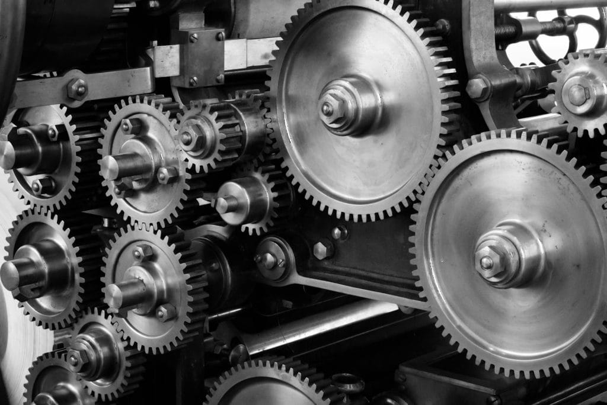

For a long time, many of us believed adulthood was simple. You study hard, get good grades, find a steady job, and work until retirement. This plan promised safety and happiness. But the world has changed. Now, the meaning of adulthood is changing too. Economic efficiency through self-responsibility is becoming the new way forward.

## Why the Old Path Is Broken: The Case for Economic Efficiency Through Self-Responsibility

In the past, Western societies told us to trust the system. Schools would prepare us. Companies would reward us. Governments would support us when we got old. However, this system is starting to fail. Public pensions are under pressure. Fewer young people are working, and more people are living longer. The OECD warns that many countries may not be able to keep their promises about retirement \[[OECD Pension Outlook](https://www.oecd.org/pensions/oecd-pensions-outlook-2022-6b1d1c02-en.htm)\].

At the same time, the corporate world is not as safe as it once seemed. Layoffs, automation, and constant change make job security a thing of the past. Many professionals feel stuck, even if they have good jobs. Worries about the future are common. Clearly, the old path does not work anymore.

## Defining Economic Efficiency Through Self-Responsibility

Economic efficiency through self-responsibility means taking charge of your own life. Instead of waiting for someone else to provide safety, you create it yourself. You find your strengths, look for real problems in the market, and offer solutions. Setting your own prices and building a life that matches your values becomes possible.

This approach is not just about making money. It is about living with purpose and freedom. When you take responsibility for your own future, you help the whole economy. You become more creative, flexible, and ready for change. In fact, economic efficiency through self-responsibility is good for everyone.

## Professionals Who Chose Economic Efficiency Through Self-Responsibility

Let’s look at some real examples. Paul Jarvis used to work in web design agencies. He decided to leave and start his own solo business. Waiting for a company to give him a mission was not his style. Instead, he created his own path and now helps other freelancers do the same \[[Paul Jarvis – Company of One](https://www.pjrvs.com/)\].

Dorie Clark is another great example. She left her job in journalism and became a best-selling author and consultant. She saw what organizations needed—better strategy and personal branding—and built her own business around those skills \[[Dorie Clark](https://dorieclark.com/)\]. Both Paul and Dorie show how economic efficiency through self-responsibility can lead to success and freedom.

## Why Experienced Professionals Are Ready for Economic Efficiency Through Self-Responsibility

You might think it is too late to change. However, your experience is your biggest strength. Years in the workforce have taught you how to solve problems. You have seen what works and what does not. Skills that younger people do not have yet are already in your toolkit.

Research shows that older entrepreneurs are more likely to succeed. The Harvard Business Review found that the average age of a successful startup founder is 45 \[[HBR: The Age of Successful Entrepreneurs](https://hbr.org/2018/07/research-the-average-age-of-a-successful-startup-founder-is-45)\]. Experience is not a weakness. It is your secret weapon for economic efficiency through self-responsibility.

## How Economic Efficiency Through Self-Responsibility Strengthens Society

When more people take responsibility for their own lives, the whole economy gets stronger. Small businesses and solo entrepreneurs are more flexible and creative. Adapting quickly to changes becomes their advantage. Wasting resources or getting stuck in old ways is less likely.

A report from the European Commission says that small and medium-sized businesses make up over 99% of all companies in the EU. These organizations provide two-thirds of private sector jobs \[[European Commission: SMEs](https://single-market-economy.ec.europa.eu/smes_en)\]. Imagine if more experienced professionals joined this group. Wisdom and stability would flow into a part of the economy that is already growing fast. This is economic efficiency through self-responsibility in action.

## Waking Up Your Independence Muscle

You do not have to quit your job tomorrow, but let’s be honest: if you want real economic efficiency through self-responsibility, you will eventually need to make a leap. Staying in your comfort zone forever is not an option. Most of us have let our “independence muscle” go numb after years of relying on job security. That muscle needs to be awakened and exercised, even if it feels awkward at first.

Start by changing how you see yourself. Instead of thinking of yourself as just an employee, begin to see yourself as a problem-solver and a value creator. This shift in mindset is essential. Next, identify what you do best and what problems you are uniquely positioned to solve. Who needs your help? What are they willing to pay for? These questions are not just theoretical—they are the foundation of your new path.

### Making the Leap: Embracing Discomfort for Economic Efficiency Through Self-Responsibility

While you can begin by testing ideas on the side, remember that true independence requires commitment. At some point, you will face a crossroads. The safety of a steady paycheck will tempt you to stay put, but growth only happens when you step into discomfort. Saying “no” to a promotion or “yes” to your own project for the first time will make you feel exposed. That’s normal. In fact, it’s a sign you are building your independence muscle.

You will need to develop new habits. Start small, but push yourself to take on projects that stretch your skills. Seeking out feedback, even when it stings, is essential. Each uncomfortable step is a rep for your independence muscle. Over time, you will notice that what once felt risky now feels like second nature.

Eventually, you will have to make a hard decision. There is no way around it. Quitting your job and stepping into the unknown is scary, but it is also the only way to fully embrace economic efficiency through self-responsibility. The discomfort is real, but so is the reward. You will discover strengths you never knew you had, and you will inspire others to do the same.

Surround yourself with people who have already made the leap. Join communities, attend events, and learn from their stories. Their courage will remind you that you are not alone, and their advice will help you avoid common pitfalls. Every successful independent professional started with a single, uncomfortable step.

## Overcoming Fear and Old Advice on the Road to Economic Efficiency Through Self-Responsibility

It is not easy to go against what you have always been told. Friends and family may worry about your choices. They might think you are taking a big risk. But the real risk is staying stuck in a system that no longer works.

Entrepreneurship is not just for the young. Anyone who wants to take control of their life can do it. By choosing economic efficiency through self-responsibility, you are building a better future for yourself and for others.

## Conclusion

Economic efficiency through self-responsibility is the new path for adulthood. Experience is a powerful asset, especially when paired with the willingness to act. Independence is not just important—it is essential for building a resilient future. By stepping forward with courage, you can inspire others to do the same. Share your plans below, connect via [Contact Me](https://breakfreenow.co/contact-me/), or post this on Medium or other social media to inspire others.

The courage to take responsibility for your own future is the first step toward true freedom—and a more efficient world.

## References

- [OECD Pension Outlook 2022](https://www.oecd.org/pensions/oecd-pensions-outlook-2022-6b1d1c02-en.htm)

- [Paul Jarvis – Company of One](https://www.pjrvs.com/)

- [Dorie Clark](https://dorieclark.com/)

- [HBR: The Age of Successful Entrepreneurs](https://hbr.org/2018/07/research-the-average-age-of-a-successful-startup-founder-is-45)

- [European Commission: SMEs](https://single-market-economy.ec.europa.eu/smes_en)
